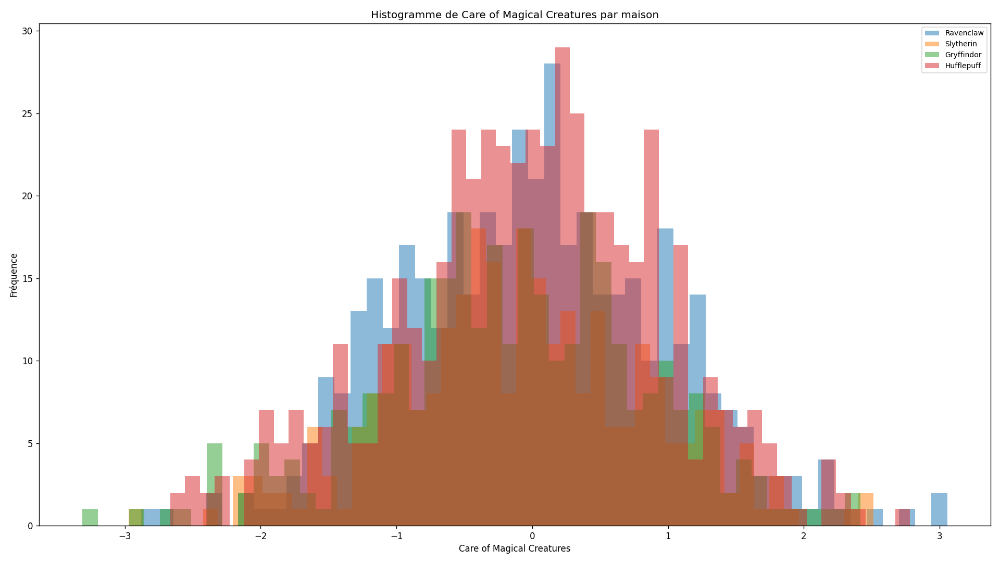
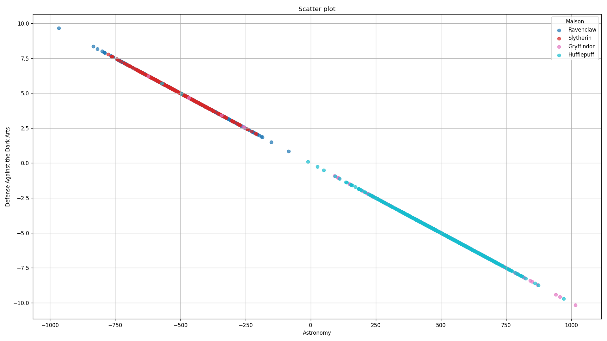
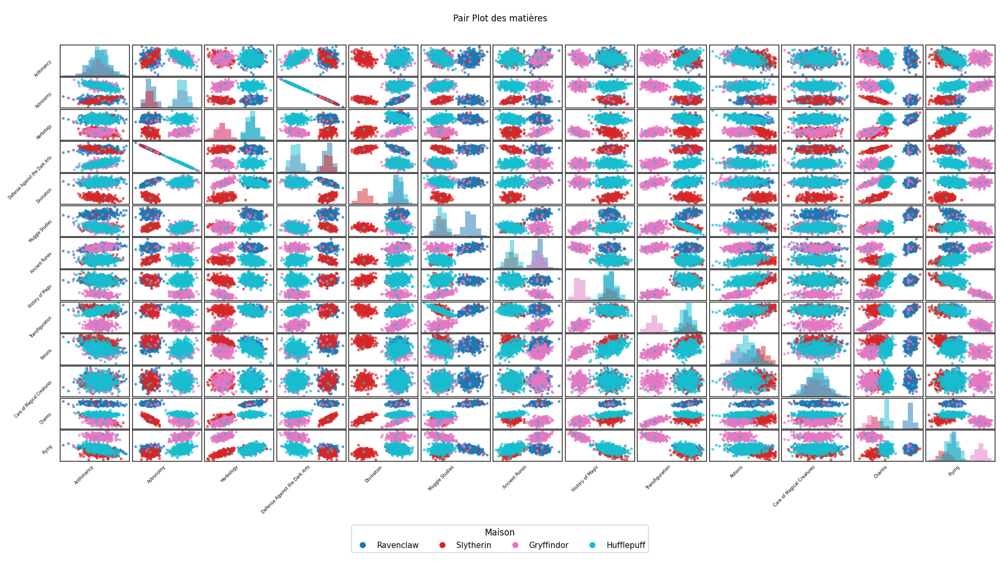
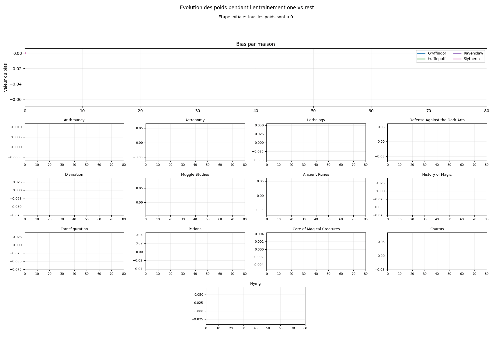
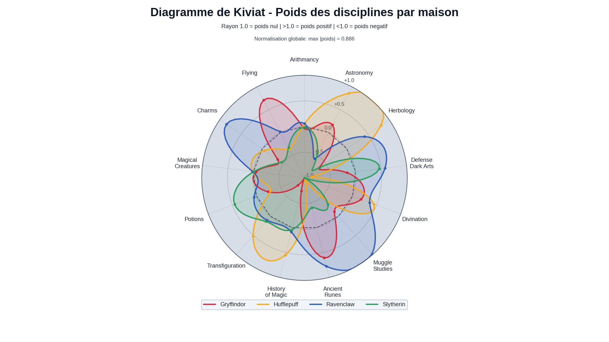

# DSLR (42) - DataScience x Logistic Regression

<div align="center">

    

</div>


Projet de classification multi-classe pour le sujet **DSLR** de 42.
Le but est de reconstruire un "Sorting Hat" avec une **régression logistique one-vs-all** implémentée sans fonctions "heavy-lifting" interdites par le sujet.

## Table des matières

- [1. Vue d'ensemble](#1-vue-densemble)
- [2. Objectifs du projet](#2-objectifs-du-projet)
- [3. Contexte pédagogique (42 / IA / ML)](#3-contexte-pédagogique-42--ia--ml)
- [4. Quick start (3 minutes)](#4-quick-start-3-minutes)
- [5. Prérequis](#5-prérequis)
- [6. Installation](#6-installation)
- [7. Utilisation](#7-utilisation)
- [8. Scripts obligatoires du sujet DSLR](#8-scripts-obligatoires-du-sujet-dslr)
- [9. Entrées / sorties importantes](#9-entrées--sorties-importantes)
- [10. Commandes Make](#10-commandes-make)
- [11. Structure du projet](#11-structure-du-projet)
- [12. Tests, qualité et outils de dev](#12-tests-qualité-et-outils-de-dev)
- [13. Conformité au sujet DSLR (checklist)](#13-conformité-au-sujet-dslr-checklist)
- [14. Troubleshooting](#14-troubleshooting)
- [15. Bonus / améliorations possibles](#15-bonus--améliorations-possibles)
- [16. Stack technique](#16-stack-technique)
- [17. Ressources](#17-ressources)
- [18. Licence](#18-licence)
- [19. Auteur](#19-auteur)

## 1. Vue d'ensemble

Ce dépôt contient :
- des scripts d'exploration de données (`describe`, `histogram`, `scatter_plot`, `pair_plot`) ;
- un entraînement de régression logistique multi-classe (`logreg_train`) ;
- une prédiction (`logreg_predict`) qui génère `houses.csv`.

Le flux principal est :
`comprendre les données -> visualiser -> entraîner -> prédire -> comparer`.

## 2. Objectifs du projet

- Implémenter une analyse descriptive sans `DataFrame.describe()`.
- Répondre aux 3 questions de visualisation imposées par le sujet.
- Implémenter une régression logistique **one-vs-all**.
- Utiliser la **descente de gradient** pour l'entraînement.
- Générer `houses.csv` au format attendu.

## 3. Contexte pédagogique (42 / IA / ML)

Ce projet fait partie du cursus 42 autour de l'IA/ML :
- lecture et nettoyage d'un dataset ;
- visualisation pour guider la sélection de features ;
- classification supervisée multi-classe.

Le sujet impose une partie technique, mais aussi une capacité à expliquer les notions (mean/std/quartiles, normalisation, one-vs-all, etc.) pendant la soutenance.

## 4. Quick start (3 minutes)

```bash
# 1) Cloner
 git clone git@github.com:Sycourbi/dslr.git
 cd dslr

# 2) Installer l'environnement
 make

# 3) Pipeline minimum
 make describe
 make train
 make predict
```

Résultats attendus :
- `make describe` affiche les stats en console.
- `make train` crée `weights.json`.
- `make predict` crée `houses.csv`.

## 5. Prérequis

- `python3` (version minimale officielle : `[À compléter]`)
- `make`
- accès shell Linux/macOS (ou équivalent)

Dépendances Python installées depuis `requirements.txt` :
- `numpy`
- `pandas`
- `matplotlib`
- `scikit-learn` (utile pour le benchmark, pas pour l'algorithme "from scratch")

## 6. Installation

### Option A (recommandée)

```bash
make
```

Cette commande exécute `make install` :
- création de `.venv` ;
- installation des dépendances via `pip install -r requirements.txt`.


## 7. Utilisation

### 7.1 Exploration des données

```bash
make describe
make histogram
make scatter
make pair
```

Sorties générées :
- `visuals/histogram.png`
- `visuals/scatter.png`
- `visuals/pair_plot.png`

Format par défaut des visuels :
- `1920x1080` (`16:9`) pour `histogram`, `scatter` et `pair_plot` (affichage homogène sur écran PC portable).

### 7.1.1 Correspondance commandes -> graphiques

| Commande | Graphique généré | Aperçu |
|---|---|---|
| `make histogram` | `histogram` |  |
| `make scatter` | `scatter plot` |  |
| `make pair` | `pair plot` |  |
| `make animate` | `logreg_train_weights` |  |
| `make kiviat` | `kiviat_house_discipline_weights` | |


### 7.2 Entraînement et prédiction

```bash
make train
make predict
```

Sorties générées :
- `weights.json`
- `houses.csv`

### 7.3 Exemple en ligne de commande (sans Make)

```bash
.venv/bin/python scripts/logreg_train.py datasets/dataset_train.csv --alpha 0.01 --iterations 1000 --out weights.json
.venv/bin/python scripts/logreg_predict.py datasets/dataset_test.csv weights.json --out houses.csv
```

## 8. Scripts obligatoires du sujet DSLR

| Script | Statut sujet | Question/objectif | Entrée principale | Sortie principale |
|---|---|---|---|---|
| `scripts/describe.py` | `Obligatoire` | Afficher `count/mean/std/min/25%/50%/75%/max` des features numériques | `dataset_train.csv` | Affichage console |
| `scripts/histogram.py` | `Obligatoire` | Trouver un cours avec distribution homogène entre maisons | `dataset_train.csv` | `visuals/histogram.png` |
| `scripts/scatter_plot.py` | `Obligatoire` | Trouver deux features similaires | `dataset_train.csv` | `visuals/scatter.png` |
| `scripts/pair_plot.py` | `Obligatoire` | Visualiser les paires pour choisir les features du modèle | `dataset_train.csv` | `visuals/pair_plot.png` |
| `scripts/logreg_train.py` | `Obligatoire` | Entraîner la régression logistique multi-classe one-vs-all via gradient descent | `dataset_train.csv` | `weights.json` |
| `scripts/logreg_predict.py` | `Obligatoire` | Prédire et générer le fichier de rendu | `dataset_test.csv` + `weights.json` | `houses.csv` |

## 9. Entrées / sorties importantes

### Fichiers d'entrée

- `datasets/dataset_train.csv`
  - contient la cible `Hogwarts House` (pour l'entraînement)
- `datasets/dataset_test.csv`
  - utilisé pour la prédiction

### Fichiers de sortie

- `weights.json`
  - paramètres du modèle entraîné (`thetas`, `mu`, `sigma`, `features`, mapping des classes)
- `houses.csv`
  - format attendu :

```csv
Index,Hogwarts House
0,Hufflepuff
1,Ravenclaw
2,Gryffindor
...
398,Ravenclaw
399,Ravenclaw
```

## 10. Commandes Make

```bash
make install     # crée .venv + installe requirements
make describe    # stats descriptives
make histogram   # histogramme
make scatter     # scatter plot
make pair        # pair plot
make train       # entraîne et écrit weights.json
make predict     # prédit et écrit houses.csv
make clean       # supprime sorties générées
make re          # clean + install
make help        # affiche l'aide
```

## 11. Structure du projet

```text
dslr/
├── datasets/
│   ├── dataset_train.csv
│   └── dataset_test.csv
├── scripts/
│   ├── describe.py
│   ├── histogram.py
│   ├── scatter_plot.py
│   ├── pair_plot.py
│   ├── logreg_train.py
│   └── logreg_predict.py
├── scikit/
│   └── benchmark_sklearn_vs_mine.py
├── Makefile
├── requirements.txt
├── dslr.subject.pdf
└── README.md
```

## 12. Tests, qualité et outils de dev

### Ce qui est présent

- Script de comparaison optionnel :

```bash
.venv/bin/python scikit/benchmark_sklearn_vs_mine.py \
  datasets/dataset_train.csv \
  datasets/dataset_test.csv \
  houses.csv
```

Ce script entraîne un modèle scikit-learn, génère `houses_sklearn.csv`, puis compare avec `houses.csv`.


## 13. Conformité au sujet DSLR (checklist)

### Obligatoire sujet

- `describe` présent : `Oui`
- `histogram` présent : `Oui`
- `scatter_plot` présent : `Oui`
- `pair_plot` présent : `Oui`
- `logreg_train` présent : `Oui`
- `logreg_predict` présent : `Oui`
- Logique multi-classe `one-vs-all` : `Oui` (dans `logreg_train.py`)
- Descente de gradient : `Oui` (dans `logreg_train.py`)
- Génération de `houses.csv` : `Oui` (dans `logreg_predict.py`)

### Points d'évaluation importants à connaître

- Pas de fonctions interdites qui font tout le travail dans `describe`.
- Format de sortie `houses.csv` strict.
- Objectif de précision à la soutenance : minimum `98%` (selon le sujet/grille).
- Bonus évalués seulement si le mandatory est parfait.

## 14. Troubleshooting

- Erreur `No such file or directory: 'weights.json'` lors de `make predict`
  - Cause : `make train` non exécuté (ou `weights.json` supprimé).
  - Fix : relancer `make train`, puis `make predict`.

- `python3-venv is missing`
  - Le `Makefile` tente automatiquement un fallback avec `virtualenv` utilisateur.

- Aucune image générée
  - Vérifier que le dossier de sortie existe (`visuals/`) ou passer `-o <dossier>`.

## 15. Bonus / améliorations possibles

`Bonus sujet` (liste du PDF) :
- ajouter d'autres métriques dans `describe`
- implémenter une descente stochastique du gradient
- implémenter d'autres algorithmes d'optimisation (GD par lots/GD par mini-lots/etc.) nombre d'échantillons

## 16. Stack technique

- Langage : `Python`
- Data : `pandas`, `numpy`
- Visualisation : `matplotlib`
- Référence de comparaison : `scikit-learn` (script optionnel)
- Orchestration locale : `Makefile`

## 17. Ressources

- [Scikit-learn](https://scikit-learn.org/stable/)
- [Matplotlib](https://matplotlib.org/)
- [NumPy](https://numpy.org/)
- [Pandas](https://pandas.pydata.org/)

## 18. Licence

MIT License.

## 19. Auteurs


- **Sylvanna Courbis** — [LinkedIn](https://www.linkedin.com/in/sylvanna-courbis-7626b63a7/) · [GitHub](https://github.com/Sycourbi)
- **Rafael Verissimo** — [LinkedIn](https://www.linkedin.com/in/verissimo-rafael/) · [GitHub](https://github.com/raveriss)
