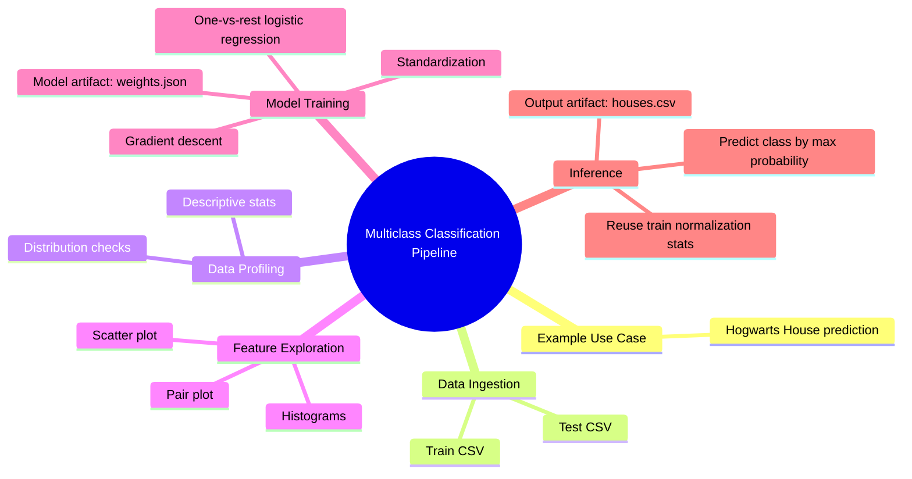

# End-to-End Multiclass Classification Pipeline (Python) - DSLR

<div align="center">

    


</div>

Projet d'IA appliquée qui implémente un pipeline complet de classification multi-classe, de l'exploration de données jusqu'à l'inférence, et réutilisable pour d'autres cas métiers de classification tabulaire.

## 🧭 Table des matières

- [💼 Vue d'ensemble](#overview)
- [🗺️ Carte du pipeline](#pipeline-map)
- [🎯 Objectifs du projet](#project-goals)
- [🎓 Contexte pédagogique (42 / IA / ML)](#project-context)
- [🚀 Quick Start (3 minutes)](#quick-start)
- [📚 Documentation](#documentation)
- [✅ Prérequis](#prerequisites)
- [⚙️ Installation](#installation)
- [🛠️ Utilisation](#usage)
- [📜 Scripts obligatoires du sujet DSLR](#required-scripts)
- [📥📤 Entrées / sorties importantes](#inputs-outputs)
- [📋 Commandes Make](#make-commands)
- [🖥️ Sorties terminal (tronquées)](#terminal-output)
- [🗂️ Structure du projet](#project-structure)
- [🧪 Tests, qualité et outils de dev](#quality-tests)
- [✅ Conformité au sujet DSLR (checklist)](#checklist)
- [🩺 Troubleshooting](#troubleshooting)
- [✨ Bonus / améliorations possibles](#bonus)
- [🧰 Stack technique](#tech-stack)
- [🔗 Ressources](#resources)
- [🛡️ Licence](#license)
- [👥 Auteurs](#authors)

<a id="overview"></a>
## 💼 Vue d'ensemble

Ce dépôt contient :
- des scripts d'exploration de données (`describe`, `histogram`, `scatter_plot`, `pair_plot`) ;
- un entraînement de régression logistique multi-classe (`logreg_train`) ;
- une prédiction (`logreg_predict`) qui génère `houses.csv`.

Le flux principal est :
`comprendre les données -> visualiser -> entraîner -> prédire -> comparer`.

<a id="pipeline-map"></a>
## 🗺️ Carte du pipeline



### 🧩 Pipeline détaillé

Le détail du pipeline est maintenant documenté dans `docs/` :
- [Pipeline global](docs/pipeline.md)
- [Étapes du training](docs/training.md)
- [Étapes de la prédiction](docs/prediction.md)

<a id="project-goals"></a>
## 🎯 Objectifs du projet

- Implémenter une analyse descriptive sans `DataFrame.describe()`.
- Répondre aux 3 questions de visualisation imposées par le sujet.
- Implémenter une régression logistique **one-vs-all**.
- Utiliser la **descente de gradient** pour l'entraînement.
- Générer `houses.csv` au format attendu.

<a id="project-context"></a>
## 🎓 Contexte pédagogique (42 / IA / ML)

Ce projet fait partie du cursus 42 autour de l'IA/ML :
- lecture et nettoyage d'un dataset ;
- visualisation pour guider la sélection de features ;
- classification supervisée multi-classe.

Le sujet impose une partie technique, mais aussi une capacité à expliquer les notions (mean/std/quartiles, normalisation, one-vs-all, etc.) pendant la soutenance.

<a id="quick-start"></a>
## 🚀 Quick Start (3 minutes)

```bash
# 1) Cloner
 git clone git@github.com:Sycourbi/dslr.git
 cd dslr

# 2) Installer l'environnement
 make

# 3) Pipeline minimum
 make describe
 make train
 make predict
```

Résultats attendus :
- `make describe` affiche les stats en console.
- `make train` crée `weights.json`.
- `make predict` crée `houses.csv`.

<a id="documentation"></a>
## 📚 Documentation

- [Pipeline global](docs/pipeline.md)
- [Étapes du training](docs/training.md)
- [Étapes de la prédiction](docs/prediction.md)

<a id="prerequisites"></a>
## ✅ Prérequis

- `python3` (`3.10+` recommandé)
- `make`
- accès shell Linux/macOS (ou équivalent)

Dépendances Python installées depuis `requirements.txt` :
- `numpy`
- `pandas`
- `matplotlib`
- `scikit-learn` (utile pour le benchmark, pas pour l'algorithme "from scratch")

<a id="installation"></a>
## ⚙️ Installation

### 🟢 Option A (recommandée)

```bash
make
```

Cette commande exécute `make install` :
- création de `.venv` ;
- installation des dépendances via `pip install -r requirements.txt`.


<a id="usage"></a>
## 🛠️ Utilisation

### 🔍 Exploration des données

```bash
make describe
make histogram
make scatter
make pair
```

Sorties générées :
- `visuals/histogram.png`
- `visuals/scatter.png`
- `visuals/pair_plot.png`

Format par défaut des visuels :
- `1920x1080` (`16:9`) pour `histogram`, `scatter` et `pair_plot` (affichage homogène sur écran PC portable).

### 🖼️ Correspondance commandes -> graphiques

| Commande | Graphique généré | Aperçu |
|---|---|---|
| `make histogram` | `histogram` |  |
| `make scatter` | `scatter plot` |  |
| `make pair` | `pair plot` |  |
| `make animate` | `logreg_train_weights` |  |
| `make kiviat` | `kiviat_house_discipline_weights` | |


### 🧠 Entraînement et prédiction

Le pipeline minimum (`make train` puis `make predict`) est déjà montré dans le **Quick start**.
Cette section regroupe surtout les variantes d'exécution utiles pour l'analyse.

### 🔎 Mode analyse détaillée (verbose)

```bash
make analysis_log_train
make analysis_log_predict
```

Sorties générées :
- `weights_training.json` (poids issus du dataset d'analyse)
- `houses_training.csv` (prédictions sur dataset d'analyse)
- logs détaillés en console (gradients, scores, probabilités, etc.)

### 💻 Exemple en ligne de commande (sans Make)

```bash
.venv/bin/python scripts/logreg_train.py datasets/dataset_train.csv --alpha 0.01 --iterations 1000 --out weights.json
.venv/bin/python scripts/logreg_predict.py datasets/dataset_test.csv weights.json --out houses.csv
```

<a id="required-scripts"></a>
## 📜 Scripts obligatoires du sujet DSLR

| Script | Statut sujet | Question/objectif | Entrée principale | Sortie principale |
|---|---|---|---|---|
| `scripts/describe.py` | `Obligatoire` | Afficher `count/mean/std/min/25%/50%/75%/max` des features numériques | `dataset_train.csv` | Affichage console |
| `scripts/histogram.py` | `Obligatoire` | Trouver un cours avec distribution homogène entre maisons | `dataset_train.csv` | `visuals/histogram.png` |
| `scripts/scatter_plot.py` | `Obligatoire` | Trouver deux features similaires | `dataset_train.csv` | `visuals/scatter.png` |
| `scripts/pair_plot.py` | `Obligatoire` | Visualiser les paires pour choisir les features du modèle | `dataset_train.csv` | `visuals/pair_plot.png` |
| `scripts/logreg_train.py` | `Obligatoire` | Entraîner la régression logistique multi-classe one-vs-all via gradient descent | `dataset_train.csv` | `weights.json` |
| `scripts/logreg_predict.py` | `Obligatoire` | Prédire et générer le fichier de rendu | `dataset_test.csv` + `weights.json` | `houses.csv` |

<a id="inputs-outputs"></a>
## 📥📤 Entrées / sorties importantes

### 📥 Fichiers d'entrée

- `datasets/dataset_train.csv`
  - contient la cible `Hogwarts House` (pour l'entraînement)
- `datasets/dataset_test.csv`
  - utilisé pour la prédiction

### 📤 Fichiers de sortie

- `weights.json`
  - paramètres du modèle entraîné (`thetas`, `mu`, `sigma`, `features`, mapping des classes)
- `houses.csv`
  - format attendu :

```csv
Index,Hogwarts House
0,Hufflepuff
1,Ravenclaw
2,Gryffindor
...
398,Ravenclaw
399,Ravenclaw
```

- `visuals/histogram.png`, `visuals/scatter.png`, `visuals/pair_plot.png`
  - graphiques produits par les scripts d'exploration
- `visuals/logreg_train_weights.gif`
  - animation de l'évolution des poids pendant l'entraînement
- `visuals/kiviat_house_discipline_weights.png`
  - visualisation radar des poids par maison
- `weights_training.json`, `houses_training.csv`
  - artefacts du mode `analysis_log_*`

<a id="make-commands"></a>
## 📋 Commandes Make

| Commande | Rôle | Sortie / effet principal |
|---|---|---|
| `make` / `make all` | Alias d'installation | exécute `install` |
| `make install` | Crée/valide `.venv` + installe `requirements.txt` | environnement Python prêt |
| `make describe` | Statistiques descriptives | affichage console |
| `make histogram` | Histogrammes par matière/maison | `visuals/histogram.png` |
| `make scatter` | Nuages de points | `visuals/scatter.png` |
| `make pair` | Pair plot global | `visuals/pair_plot.png` |
| `make train` | Entraînement logreg one-vs-all | `weights.json` |
| `make predict` | Prédiction avec poids entraînés | `houses.csv` |
| `make analysis_log_train` | Entraînement verbose sur dataset d'analyse | `weights_training.json` + logs détaillés |
| `make analysis_log_predict` | Prédiction verbose sur dataset d'analyse | `houses_training.csv` + logs détaillés (nécessite `weights_training.json`) |
| `make animate` | Génère une animation de l'évolution des poids | `visuals/logreg_train_weights.gif` |
| `make kiviat` | Génère un radar des poids par maison | `visuals/kiviat_house_discipline_weights.png` |
| `make clean` | Supprime artefacts générés | supprime `weights.json`, `houses.csv`, `visuals/`, caches Python (conserve `weights_training.json` et `houses_training.csv`) |
| `make fclean` | Nettoyage complet | `clean` + suppression `.venv` |
| `make re` | Réinitialisation environnement | `fclean` puis `all` |
| `make help` | Aide intégrée | affichage des targets |

<a id="terminal-output"></a>
## 🖥️ Sorties terminal (tronquées)

### `make install`

```bash
$ make install
.venv/bin/pip install -r requirements.txt
Requirement already satisfied: numpy ...
Requirement already satisfied: pandas ...
Requirement already satisfied: matplotlib ...
Requirement already satisfied: scikit-learn ...
...
```

### `make analysis_log_train`

```bash
$ make analysis_log_train
.venv/bin/python scripts/logreg_train.py datasets/dataset_analyse_log_train.csv \
  --alpha 0.01 --iterations 3 --analysis-log --out weights_training.json

students_disciplines_scores : 
    Astronomy  Muggle Studies    Potions  Flying
0 -487.886086      272.035831   3.790369  -26.89
1 -552.060507     -487.340557   7.248742 -113.45
2  527.193585     -398.101991   2.068824   -0.09
3  697.742809     -537.001128   0.821911  200.64
4 -613.687160     -440.997704  11.751212  -34.69
5  628.046051     -926.892512   1.646666  261.55

standardized_disciplines_scores : 
[[-0.88676716  1.95008428 -0.19933026 -0.55263993]
 [-0.99597189 -0.19063607  0.70267424 -1.19272173]
 [ 0.84057989  0.06093195 -0.64833946 -0.35446304]
 [ 1.13080114 -0.33063173 -0.97355648  1.12986712]
 [-1.10084111 -0.05999323  1.87699766 -0.61031828]
 [ 1.01219913 -1.42975521 -0.7584457   1.58027587]]

/*   -'-,-'-,-'-,-'-,-'-,-'-,-'-,-'-,-'-,-'-,-'-,-'-,-'-,-'-,-'-,-'-,-',-'   */
/*                                 HOUSE                                     */
/*                               GRYFFINDOR                                  */
/*   -'-,-'-,-'-,-'-,-'-,-'-,-'-,-'-,-'-,-'-,-'-,-'-,-'-,-'-,-'-,-'-,-',-'   */

ARE_STUDENTS_ASSIGNED_TO_CURRENT_HOUSE : [0. 0. 0. 1. 0. 1.]

                        /*   -'-,-'-,-'-,-'-,-'-,-   */
                        /*    ITERATION_COUNT : 0    */
                        /*   -'-,-'-,-'-,-'-,-'-,-   */

PREDICTED_PROBABILITY_OF_CURRENT_HOUSE
CALCULE :
compute_sigmoid(students_disciplines_scores_with_bias.dot(current_house_weights))
compute_sigmoid(students_disciplines_scores_with_bias.dot([0. 0. 0. 0. 0.]))
compute_sigmoid([0. 0. 0. 0. 0. 0.])
--------------------------------------------------------------
= [0.5 0.5 0.5 0.5 0.5 0.5]

PREDICTION_ERROR_BY_STUDENTS
CALCULE :
predicted_probability_of_current_house - are_students_assigned_to_current_house
[0.5 0.5 0.5 0.5 0.5 0.5] - [0. 0. 0. 1. 0. 1.]
--------------------------------------------------------------
= [ 0.5  0.5  0.5 -0.5  0.5 -0.5]

...

/*   -'-,-'-,-'-,-'-,-'-,-'-,-'-,-'-,-'-,-'-,-'-,-'-,-'-,-'-,-'-,-'-,-',-'   */

CURRENT_HOUSE_WEIGHTS
CALCULE :
current_house_weights - learning_rate * current_house_weight_gradient
[0. 0. 0. 0. 0.] - 0.01 * [ 0.16666667 -0.35716671  0.29339782  0.28866703 -0.4516905 ]
[0. 0. 0. 0. 0.] - [ 0.00166667 -0.00357167  0.00293398  0.00288667 -0.0045169 ]
--------------------------------------------------------------
[-0.00166667  0.00357167 -0.00293398 -0.00288667  0.0045169 ]
```

### `make analysis_log_predict`

```bash
STUDENTS_DISCIPLINE_SCORES
= 
    Astronomy  Muggle Studies    Potions  Flying
0 -487.886086      272.035831   3.790369  -26.89
1 -552.060507     -487.340557   7.248742 -113.45
2  527.193585     -398.101991   2.068824   -0.09
3  697.742809     -537.001128   0.821911  200.64
4 -613.687160     -440.997704  11.751212  -34.69
5  628.046051     -926.892512   1.646666  261.55

/*   -'-,-'-,-'-,-'-,-'-,-'-,-'-,-'-,-'-,-'-,-'-,-'-,-'-,-'-,-'-,-'-,-',-'   */

STANDARDIZED_STUDENTS_DISCIPLINE_SCORES
CALCULE :
(students_discipline_scores - average_discipline_scores) / discipline_standard_deviations
([[-4.87886086e+02  2.72035831e+02  3.79036907e+00 -2.68900000e+01]
 [-5.52060507e+02 -4.87340557e+02  7.24874198e+00 -1.13450000e+02]
 [ 5.27193585e+02 -3.98101991e+02  2.06882418e+00 -9.00000000e-02]
 [ 6.97742809e+02 -5.37001128e+02  8.21910501e-01  2.00640000e+02]
 [-6.13687160e+02 -4.40997704e+02  1.17512120e+01 -3.46900000e+01]
 [ 6.28046051e+02 -9.26892512e+02  1.64666614e+00  2.61550000e+02]] - [  33.22478191 -419.71634351    4.55462065   47.845     ]) / [587.65241946 354.72937305   3.83409716 135.23271716]
--------------------------------------------------------------
=
[[-0.88676716  1.95008428 -0.19933026 -0.55263993]
 [-0.99597189 -0.19063607  0.70267424 -1.19272173]
 [ 0.84057989  0.06093195 -0.64833946 -0.35446304]
 [ 1.13080114 -0.33063173 -0.97355648  1.12986712]
 [-1.10084111 -0.05999323  1.87699766 -0.61031828]
 [ 1.01219913 -1.42975521 -0.7584457   1.58027587]]

...

/*   -'-,-'-,-'-,-'-,-'-,-'-,-'-,-'-,-'-,-'-,-'-,-'-,-'-,-'-,-'-,-'-,-',-'   */

PREDICTED_HOUSE_NAMES_FOR_ALL_STUDENTS
CALCULE :
[house_name_by_code[int(house_code)] for house_code in predicted_house_codes_for_all_students]
house_name_by_code = {0: 'Gryffindor', 1: 'Hufflepuff', 2: 'Ravenclaw', 3: 'Slytherin'}
[house_name_by_code[int(house_code)] for house_code in [2 3 0 0 3 0]]
--------------------------------------------------------------
=
['Ravenclaw', 'Slytherin', 'Gryffindor', 'Gryffindor', 'Slytherin', 'Gryffindor']

/*   -'-,-'-,-'-,-'-,-'-,-'-,-'-,-'-,-'-,-'-,-'-,-'-,-'-,-'-,-'-,-'-,-',-'   */

NUMBER_OF_PREDICTED_HOUSE_NAMES_FOR_ALL_STUDENTS
CALCULE :
len(predicted_house_names_for_all_students)
len(['Ravenclaw', 'Slytherin', 'Gryffindor', 'Gryffindor', 'Slytherin', 'Gryffindor'])
--------------------------------------------------------------
=
6
→ Fichier de prediction enregistre dans houses_training.csv
```

<a id="project-structure"></a>
## 🗂️ Structure du projet

```text
dslr/
├── datasets/
│   ├── dataset_train.csv
│   └── dataset_test.csv
├── docs/
│   ├── assets/
│   ├── pipeline.md
│   ├── training.md
│   └── prediction.md
├── scripts/
│   ├── describe.py
│   ├── histogram.py
│   ├── scatter_plot.py
│   ├── pair_plot.py
│   ├── logreg_train.py
│   └── logreg_predict.py
├── scikit/
│   └── benchmark_sklearn_vs_mine.py
├── Makefile
├── requirements.txt
├── dslr.subject.pdf
└── README.md
```

<a id="quality-tests"></a>
## 🧪 Tests, qualité et outils de dev

### ✅ Ce qui est présent

- Script de comparaison optionnel :

```bash
.venv/bin/python scikit/benchmark_sklearn_vs_mine.py \
  datasets/dataset_train.csv \
  datasets/dataset_test.csv \
  houses.csv
```

Ce script entraîne un modèle scikit-learn, génère `houses_sklearn.csv`, puis compare avec `houses.csv`.


<a id="checklist"></a>
## ✅ Conformité au sujet DSLR (checklist)

### 📌 Obligatoire sujet

- `describe` présent : `Oui`
- `histogram` présent : `Oui`
- `scatter_plot` présent : `Oui`
- `pair_plot` présent : `Oui`
- `logreg_train` présent : `Oui`
- `logreg_predict` présent : `Oui`
- Logique multi-classe `one-vs-all` : `Oui` (dans `logreg_train.py`)
- Descente de gradient : `Oui` (dans `logreg_train.py`)
- Génération de `houses.csv` : `Oui` (dans `logreg_predict.py`)

### 🧠 Points d'évaluation importants à connaître

- Pas de fonctions interdites qui font tout le travail dans `describe`.
- Format de sortie `houses.csv` strict.
- Objectif de précision à la soutenance : minimum `98%` (selon le sujet/grille).
- Bonus évalués seulement si le mandatory est parfait.

<a id="troubleshooting"></a>
## 🩺 Troubleshooting

- Erreur `No such file or directory: 'weights.json'` lors de `make predict`
  - Cause : `make train` non exécuté (ou `weights.json` supprimé).
  - Fix : relancer `make train`, puis `make predict`.

- `python3-venv is missing`
  - Le `Makefile` tente automatiquement un fallback avec `virtualenv` utilisateur.

- Aucune image générée
  - Vérifier que le dossier de sortie existe (`visuals/`) ou passer `-o <dossier>`.

<a id="bonus"></a>
## ✨ Bonus / améliorations possibles

`Bonus sujet` (liste du PDF) :
- ajouter d'autres métriques dans `describe`
- implémenter une descente stochastique du gradient
- implémenter d'autres algorithmes d'optimisation (GD par lots/GD par mini-lots/etc.) nombre d'échantillons

<a id="tech-stack"></a>
## 🧰 Stack technique

- Langage : `Python`
- Data : `pandas`, `numpy`
- Visualisation : `matplotlib`
- Référence de comparaison : `scikit-learn` (script optionnel)
- Orchestration locale : `Makefile`

<a id="resources"></a>
## 🔗 Ressources

- [Scikit-learn](https://scikit-learn.org/stable/)
- [Matplotlib](https://matplotlib.org/)
- [NumPy](https://numpy.org/)
- [Pandas](https://pandas.pydata.org/)

<a id="license"></a>
## 🛡️ Licence

MIT License.

<a id="authors"></a>
## 👥 Auteurs

- **Sylvanna Courbis** — [LinkedIn](https://www.linkedin.com/in/sylvanna-courbis-7626b63a7/) · [GitHub](https://github.com/Sycourbi)
- **Rafael Verissimo** — [LinkedIn](https://www.linkedin.com/in/verissimo-rafael/) · [GitHub](https://github.com/raveriss)
