# Pipeline DSLR

Cette page décrit le flux complet du programme DSLR, de l'entraînement à la prédiction finale.

## Vue globale

```mermaid
flowchart TB
    START["Start DSLR pipeline"] --> TRAIN_CMD["Run training command"]
    TRAIN_CMD --> TR_MAIN["logreg_train main with try except"]
    TR_MAIN -. "exception" .-> TR_ERR["print training error message"]

    subgraph TRAIN_PHASE["Phase 1 training logreg_train.py"]
        TR_MAIN --> TR_PARSE["parse_command_line_arguments"]
        TR_PARSE --> TR_ARGS["args: input_csv_path alpha iterations out analysis_log"]
        TR_ARGS --> TR_LOGGER["create AnalysisLogger"]
        TR_LOGGER --> TR_LOAD_CALL["call load_and_prepare_dataset"]

        subgraph TRAIN_LOAD["load_and_prepare_dataset"]
            TL1["read training csv with pandas"] --> TL2["get_discipline_names from numeric columns"]
            TL2 --> TL3["remove Index from feature list"]
            TL3 --> TL4["drop rows with missing target or missing selected features"]
            TL4 --> TL5["build X_train dataframe with selected features"]
            TL5 --> TL6["define fixed house order Gryffindor Hufflepuff Ravenclaw Slytherin"]
            TL6 --> TL7["build house_code_by_name and house_name_by_code"]
            TL7 --> TL8["encode target Hogwarts House into integer y_train"]
            TL8 --> TL9["return X_train y_train mappings features"]
        end

        TR_LOAD_CALL --> TL1
        TL9 --> TR_STD_CALL["call standardize_disciplines_scores"]

        subgraph TRAIN_STD["standardize_disciplines_scores"]
            TS1["convert X_train dataframe to float numpy"] --> TS2["compute mu mean by column"]
            TS2 --> TS3["compute sigma std by column ddof 0"]
            TS3 --> TS4["compute X_std = (X - mu) / sigma"]
            TS4 --> TS5["return X_std mu sigma"]
        end

        TR_STD_CALL --> TS1
        TS5 --> TR_BIAS["add bias column of ones to X_std"]
        TR_BIAS --> TR_LOG_INIT{"analysis_log enabled"}
        TR_LOG_INIT -- "yes" --> TR_LOG_INIT_CALL["log_initial_scores"]
        TR_LOG_INIT -- "no" --> TR_FIT_CALL
        TR_LOG_INIT_CALL --> TR_FIT_CALL["call fit_one_vs_rest_house_classifier"]

        subgraph TRAIN_FIT["fit_one_vs_rest_house_classifier"]
            TF1["read matrix shape students_count and feature_count_with_bias"] --> TF2["unique_house_codes from y_train"]
            TF2 --> TF3["allocate weight matrix zeros n_classes by feature_count_with_bias"]
            TF3 --> TF_HOUSE_LOOP{"next house code"}
            TF_HOUSE_LOOP -- "yes" --> TF4["init current_house_weights as zeros"]
            TF4 --> TF5["build binary target y_binary for current house"]
            TF5 --> TF_LOG_H{"analysis_log enabled"}
            TF_LOG_H -- "yes" --> TF_LOG_H_CALL["log_house_header and log_students_assigned_to_current_house"]
            TF_LOG_H -- "no" --> TF_ITER_LOOP
            TF_LOG_H_CALL --> TF_ITER_LOOP{"next iteration"}
            TF_ITER_LOOP -- "yes" --> TF6["compute p = sigmoid(X_bias dot current_house_weights)"]
            TF6 --> TF7["compute error = p - y_binary"]
            TF7 --> TF8["compute grad_sum = X_bias transpose dot error"]
            TF8 --> TF9["compute gradient = grad_sum / students_count"]
            TF9 --> TF10["update current_house_weights = current_house_weights - alpha * gradient"]
            TF10 --> TF_LOG_I{"analysis_log enabled"}
            TF_LOG_I -- "yes" --> TF_LOG_I_CALL["log iteration header probabilities errors gradient and updated weights"]
            TF_LOG_I -- "no" --> TF_ITER_NEXT
            TF_LOG_I_CALL --> TF_ITER_NEXT{"more iterations"}
            TF_ITER_NEXT -- "yes" --> TF6
            TF_ITER_NEXT -- "no" --> TF11["store current_house_weights in global weight matrix row"]
            TF11 --> TF_LOG_W{"analysis_log enabled"}
            TF_LOG_W -- "yes" --> TF_LOG_W_CALL["log_house_disciplines_weights"]
            TF_LOG_W -- "no" --> TF_HOUSE_NEXT
            TF_LOG_W_CALL --> TF_HOUSE_NEXT{"more houses"}
            TF_HOUSE_NEXT -- "yes" --> TF4
            TF_HOUSE_NEXT -- "no" --> TF12["return full weight matrix"]
        end

        TR_FIT_CALL --> TF1
        TF12 --> TR_BUNDLE["build trained_parameter_bundle with thetas mu sigma features house_map inv_house_map"]
        TR_BUNDLE --> TR_SAVE["open output json path and json dump bundle"]
        TR_SAVE --> WEIGHTS["weights.json saved"]
        WEIGHTS --> TR_OK["print training success message"]
    end

    TR_OK --> PRED_CMD["Run prediction command"]
    PRED_CMD --> PR_MAIN["logreg_predict main with try except"]
    PR_MAIN -. "exception" .-> PR_ERR["print prediction error message"]

    subgraph PRED_PHASE["Phase 2 prediction logreg_predict.py"]
        PR_MAIN --> PR_PARSE["parse_command_line_arguments"]
        PR_PARSE --> PR_ARGS["args: dataset_csv_path weights_json_path out analysis_log"]
        PR_ARGS --> PR_LOGGER["create AnalysisPredictLogger"]
        PR_LOGGER --> PR_LOAD_PARAM_CALL["call load_house_classifier_parameters"]

        subgraph PRED_LOAD_PARAM["load_house_classifier_parameters"]
            PP1["open weights json file"] --> PP2["json load bundle"]
            PP2 --> PP3["read thetas and convert to numpy array"]
            PP3 --> PP4["read mu and sigma"]
            PP4 --> PP5["read inv_house_map and convert keys to int"]
            PP5 --> PP6["read features list"]
            PP6 --> PP7["return thetas mu sigma house_name_by_code features"]
        end

        PR_LOAD_PARAM_CALL --> PP1
        PP7 --> PR_LOAD_OBS_CALL["call load_observations with test csv and features"]

        subgraph PRED_LOAD_OBS["load_observations"]
            PO1["read test csv with pandas"] --> PO2{"Index column exists"}
            PO2 -- "no" --> PO_ERR1["raise ValueError missing Index"]
            PO2 -- "yes" --> PO3["compute missing_features from expected features not in csv"]
            PO3 --> PO4{"missing_features empty"}
            PO4 -- "no" --> PO_ERR2["raise ValueError missing feature columns"]
            PO4 -- "yes" --> PO5["extract indexes list from Index column"]
            PO5 --> PO6["build X_test dataframe with training feature order"]
            PO6 --> PO7["return indexes and X_test dataframe"]
        end

        PR_LOAD_OBS_CALL --> PO1
        PO_ERR1 -. "propagate to main except" .-> PR_ERR
        PO_ERR2 -. "propagate to main except" .-> PR_ERR

        PO7 --> PR_LOG_RAW{"analysis_log enabled"}
        PR_LOG_RAW -- "yes" --> PR_LOG_RAW_CALL["log_students_discipline_scores"]
        PR_LOG_RAW -- "no" --> PR_STD_CALL
        PR_LOG_RAW_CALL --> PR_STD_CALL["call standardize_discipline_scores"]

        subgraph PRED_STD["standardize_discipline_scores"]
            PS1["convert mu to float numpy"] --> PS2["convert sigma to float numpy"]
            PS2 --> PS3["build sigma_safe with zero replaced by one"]
            PS3 --> PS4["copy X_test dataframe as float"]
            PS4 --> PS5["loop over columns and fill missing values with train mu"]
            PS5 --> PS6["convert filled dataframe to numpy array"]
            PS6 --> PS7["compute X_std = (X - mu) / sigma_safe"]
            PS7 --> PS8["return standardized matrix"]
        end

        PR_STD_CALL --> PS1
        PS8 --> PR_LOG_STD{"analysis_log enabled"}
        PR_LOG_STD -- "yes" --> PR_LOG_STD_CALL["log_standardized_students_discipline_scores"]
        PR_LOG_STD -- "no" --> PR_BIAS
        PR_LOG_STD_CALL --> PR_BIAS["add bias column of ones to standardized matrix"]

        PR_BIAS --> PR_LOG_BIAS{"analysis_log enabled"}
        PR_LOG_BIAS -- "yes" --> PR_LOG_BIAS_CALL["log_students_discipline_scores_with_bias"]
        PR_LOG_BIAS -- "no" --> PR_MODEL_CALL
        PR_LOG_BIAS_CALL --> PR_MODEL_CALL["call predict_house_names"]

        subgraph PRED_MODEL["predict_house_names"]
            PM1["compute raw scores = X_test_bias dot thetas transpose"] --> PM_LOG1{"analysis_log enabled"}
            PM_LOG1 -- "yes" --> PM_LOG1_CALL["log raw scores"]
            PM_LOG1 -- "no" --> PM2
            PM_LOG1_CALL --> PM2["clip scores to range minus 500 to plus 500"]
            PM2 --> PM_LOG2{"analysis_log enabled"}
            PM_LOG2 -- "yes" --> PM_LOG2_CALL["log clipped scores"]
            PM_LOG2 -- "no" --> PM3
            PM_LOG2_CALL --> PM3["compute probabilities with sigmoid"]
            PM3 --> PM_LOG3{"analysis_log enabled"}
            PM_LOG3 -- "yes" --> PM_LOG3_CALL["log probabilities"]
            PM_LOG3 -- "no" --> PM4
            PM_LOG3_CALL --> PM4["compute predicted class codes with argmax axis 1"]
            PM4 --> PM_LOG4{"analysis_log enabled"}
            PM_LOG4 -- "yes" --> PM_LOG4_CALL["log predicted class codes"]
            PM_LOG4 -- "no" --> PM5
            PM_LOG4_CALL --> PM5["map predicted class codes to house names"]
            PM5 --> PM_LOG5{"analysis_log enabled"}
            PM_LOG5 -- "yes" --> PM_LOG5_CALL["log predicted house names and count"]
            PM_LOG5 -- "no" --> PM6
            PM_LOG5_CALL --> PM6["return predicted house names"]
        end

        PR_MODEL_CALL --> PM1
        PM6 --> PR_OUT1["build output dataframe with columns Index and Hogwarts House"]
        PR_OUT1 --> PR_OUT2["write output dataframe to csv without row index"]
        PR_OUT2 --> HOUSES["houses.csv saved"]
        HOUSES --> PR_OK["print prediction success message"]
    end

    PR_OK --> END["End final predictions available"]
```

## Artifacts produits

- `weights.json` : paramètres du modèle entraîné (`thetas`, `mu`, `sigma`, `features`, mappings de classes).
- `houses.csv` : prédictions finales au format `Index,Hogwarts House`.

## Remarques importantes

- La cross-validation n'est pas implémentée dans le pipeline principal.
- La fonction `get_discipline_names()` présente dans `logreg_predict.py` n'est pas appelée par `main()`.
